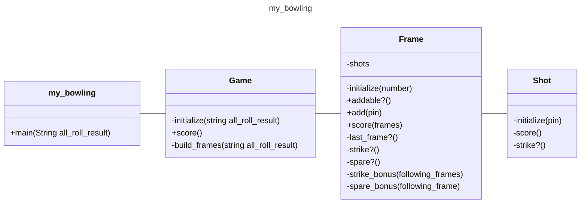

```mermaid
---
title: my_bowling
---

classDiagram
    direction LR
    my_bowling -- Game
    Game -- Frame
    Frame -- Shot

    class my_bowling{
      +main(String all_roll_result)
    }
    class Game{
      -initialize(string all_roll_result)
      +score()
      -build_frames(string all_roll_result)
    }
   class Frame{
      -shots
      -initialize(number)
      +addable?()
      +add(pin)
      +score(frames)
      -last_frame?()
      -strike?()
      -spare?()
      -strike_bonus(following_frames)
      -spare_bonus(following_frame)
    }
    class Shot{
      -initialize(pin)
      -score()
      -strike?()
    }
```
